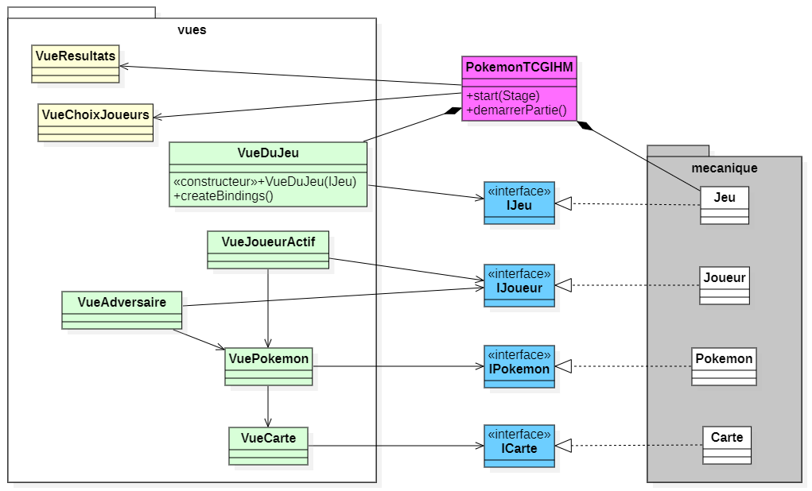

# Projet _Pokémon TCG - IHM_

### IUT Montpellier-Sète – Département Informatique

Ce projet est la suite de la [Phase 1 du projet _Pokémon TCG_](https://gitlabinfo.iutmontp.univ-montp2.fr/dev-objets/projets/pokemontcg) dans le cadre des Situations d'Apprentissage et Évaluation du BUT Informatique (SAE S2.01). Le code de cette seconde phase est **totalement indépendant** de celui de la première phase.

Dans cette phase du projet, vous allez programmer une interface graphique en _JavaFX_ pour la mécanique du jeu _Pokémon TCG_. Vous avez déjà programmé cette mécanique durant la [**Phase 1**](https://gitlabinfo.iutmontp.univ-montp2.fr/dev-objets/projets/pokemontcg). Cependant, dans cette seconde phase, le code implémentant la mécanique du jeu qui vous est donné est structuré différemment, car il a été adapté pour _JavaFX_.

## Organisation du travail

* **Phase 2 : _implémentation d'une interface graphique sous [JavaFX](https://openjfx.io/)_**
    * **Cours concerné** : _Développement d’applications avec IHM_
    * [**Support de cours**](https://gitlabinfo.iutmontp.univ-montp2.fr/ihm/ressources)

* **Enseignants :** [Sophie Nabitz](mailto:sophie.nabitz@univ-avignon.fr),
  [Cyrille Nadal](mailto:cyrille.nadal@umontpellier.fr),
  [Nathalie Palleja](mailto:nathalie.palleja@umontpellier.fr),
  [Xavier Palleja](mailto:xavier.palleja@umontpellier.fr),
  [Amal Rihani](mailto:amal.rihani@umontpellier.fr),
  [Petru Valicov](mailto:petru.valicov@umontpellier.fr)

* **Période de réalisation :** 21 mai - 13 juin 2025 à 23h

**Pour des questions :**
* Le [forum Piazza](https://piazza.com/class/m8snjyc99g2v4) - à privilégier lorsque vous avez des questions sur le projet.
* [Email](mailto:petru.valicov@umontpellier.fr) pour une question d'ordre privée concernant le projet.

## Consignes générales
Un squelette du code vous est fourni et vous devrez :
* Écrire les classes qui vous sont décrites, en ajoutant les fonctions et attributs qui vous semblent utiles.
* Vérifier que votre interface graphique réagit comme attendu. Des tests unitaires de cette interface ne sont pas demandés.
* A priori, vous ne devez pas changer les méthodes et classes de la logique du jeu qui vous sont données, sauf si les enseignants vous en informent explicitement. Toutefois, il peut y avoir un cas particulier où vous serez amenés à travailler sur la logique, voir le [paragraphe correspondant](#ajout-de-propriétés) plus loin.

Des consignes détaillées du projet vous sont données dans le fichier [Consignes.md](Consignes.md). _**Le non-respect de ces consignes impliquera une pénalité de plusieurs points sur la note finale du projet.**_

## Présentation
Vous connaissez déjà les règles, mais si besoin, vous pouvez les retrouver dans les [ressources de la phase 1](https://gitlabinfo.iutmontp.univ-montp2.fr/dev-objets/ressources).

Vous partirez d'une version du moteur déjà implémentée (la logique de l'application), qu'a priori, vous ne devez pas modifier. Cette partie est différente de la correction de la [Phase 1](https://gitlabinfo.iutmontp.univ-montp2.fr/dev-objets/projets/pokemontcg) du projet, elle a été adaptée pour réagir aux événements sur l'interface graphique. Vous considèrerez cette partie comme totalement encapsulée, non invocable directement, et vous la ferez exécuter en utilisant des interfaces _Java_ jouant un rôle de [façades](https://fr.wikipedia.org/wiki/Fa%C3%A7ade_(patron_de_conception)), permettant de communiquer avec la logique interne. Les méthodes de ces interfaces sont sommairement commentées, vous devez vous y référer (en complément du présent document) afin d'identifier laquelle utiliser dans quelle situation.

Il est important de comprendre que cette nouvelle mécanique du jeu, distribuée pour cette partie du projet, ne permettra plus de communiquer avec la logique interne via une saisie au clavier dans le terminal. Désormais, elle attend, de la part de l'utilisateur, **uniquement des interactions à travers une interface graphique**. Et ce sont ces interactions que vous devez implémenter.

Vous allez implémenter plusieurs classes (certaines méthodes vous sont suggérées), dans lesquelles vous allez ajouter tout ce qui sera utile à votre IHM.

## Architecture générale du code
Voici le **diagramme de classes simplifié** de l'application :

Pensez à le consulter en détails pour mieux vous situer.

Ce diagramme ne détaille pas les classes et relations de la partie mécanique du jeu, ni ne liste les méthodes des classes que vous utiliserez. Pour ne pas surcharger le diagramme, les attributs et les fonctions ne sont pas présentés. **Vous y voyez surtout les classes qui sont nécessaires à votre travail.**

### Le paquetage `mecanique`

Ce paquetage, en gris sur le diagramme, représente la logique interne du jeu. **Vous n'avez pas besoin d'en lire le code**. Il contient beaucoup plus de classes que celles présentées ci-dessus, elles ne vous seront pas utiles pour comprendre ce qui est à faire. Les classes de ce paquetage illustrées sur le diagramme seront utilisées indirectement dans votre code. Vous y accédez en utilisant les interfaces en bleu, dont le nom (qui commence par un `I` majuscule) correspond aux classes d'implémentation. En lisant ces interfaces "façades", vous verrez que de nombreuses propriétés sont exposées à travers les méthodes usuelles ou des _getters_. Vous devez les utiliser, dans vos vues (paquetage `vues`), pour définir vos écouteurs/gestionnaires d'événements et les écouteurs de changement qui mettront à jour votre IHM. A priori, dans ces interfaces, il y a suffisamment de propriétés exposées pour que vous puissiez réaliser votre IHM, vous n'aurez probablement pas à les modifier.

**Remarques :**
- tous les efforts ont été faits pour que cette partie ne comporte pas de bugs, mais rien n'est garanti... Si vous en rencontrez, n'hésitez pas à les faire remonter. Dans tous les cas, pour ce projet, on ne s'intéresse pas vraiment à la mécanique du jeu, mais à l'IHM correspondante.
- le talent du pokemon Lanturn n'a pas été implémenté ; cela ne devrait pas impacter votre interface.
- l'activation d'un talent d'un pokemon se fait lorsque l'utilisateur clique sur sa carte.

Remarques :
- tous les efforts ont été faits pour que cette partie ne comporte pas de bugs, mais rien n'est garanti... Si vous en rencontrez, n'hésitez pas à les faire remonter.
- le talent du pokemon Lanturn n'a pas été implémenté ; cela ne devrait pas impacter votre interface.
- l'activation d'un talent d'un pokemon se fait lorsque l'utilisateur clique sur sa carte.

### Le paquetage `vues`

Pour cette phase du projet, la partie qui vous intéresse se trouve dans ce paquetage. Il contient les classes d'IHM à implémenter, indiquées en vert sur le diagramme. Dans la suite de ce document, ces classes seront désignées par `VueXXX`. D'autres classes (en jaune sur le diagramme) peuvent être implémentées une fois que vous aurez terminé celles en vert. Voir plus bas pour des explications complémentaires.

#### Description sommaire des différentes vues :
- La classe `VueDuJeu`, première vue de l'application, présente la vue générale de l'interface graphique. Celle qui vous est donnée n'affiche rien. Vous allez donc la transformer pour intégrer de nouveaux éléments, correspondant aux classes décrites ci-dessous.
- La classe `VueDuJoueurActif` présente les éléments appartenant au joueur actif, actualisés à chaque changement de joueur.
- La classe `VueAdversaire` présente les éléments du joueur autre que le joueur actif, en cachant ceux que ce dernier n'a pas à connaître.
- La classe `VuePokemon` présente les éléments d'un pokemon, actualisés au fur et à mesure des actions du joueur.
- La classe `VueCarte` représente la vue d'une unique carte.
- La classe `VueChoixJoueurs`, qui peut éventuellement être affichée en début de partie, permet de définir les noms des joueurs de la partie.
- La classe `VueResultats` est affichée en fin de partie, elle affiche le nom du gagnant et peut éventuellement proposer de rejouer.

En consultant le code de ces classes, vous prendrez connaissance des éléments essentiels à implémenter, **auxquels vous avez toute liberté d'ajouter ce qui vous convient**. Et vous pouvez aussi, si besoin, ajouter d'autres vues qui vous paraîtraient utiles.

### Organisation interne de l'application
La classe `PokemonTCGIHM` (en rose sur le diagramme de classes) vous est fournie. Elle représente l'`Application` JavaFX et effectue essentiellement plusieurs tâches :
- Elle crée une partie (objet de type `Jeu`), qui gère la logique interne du jeu et qui s'exécute en réponse aux événements sur l'interface graphique.
- Elle crée la scène en la construisant avec la première vue, qui est un objet de type `VueDuJeu`.
- Elle crée une partie à 2 joueurs, leur donnant des noms par défaut. Si souhaité, vous pourrez faire en sorte qu'elle démarre l'interface graphique sur une fenêtre permettant de saisir les noms des joueurs de la partie. Pour cela, quelques modifications de votre part seront nécessaires (voir le [paragraphe correspondant](#ajout-dune-fenêtre-initiale-pour-le-choix-des-joueurs) plus loin).

La classe `PokemonTCGIHM` est suffisamment complète et ne nécessite aucune modification de votre part pour faire fonctionner votre programme (du moins dans l'immédiat).

### Organisation interne des interfaces d'accès à la logique du jeu
Dans les interfaces qui permettent d'accéder à la logique interne du jeu (en bleu sur le diagramme), vous constaterez que sont d'abord présentées les propriétés du jeu que vous pouvez écouter. Ensuite certains getters et enfin les méthodes que vous pouvez invoquer pour activer la logique interne.
A priori, les propriétés essentielles pour la mise en place de l'interface graphique sont exportées dans ces interfaces. Il reste possible d'y ajouter d'autres méthodes, si vous en avez besoin, et pour cela voir le [paragraphe correspondant](#ajout-de-propriétés) plus loin.

## Quelques informations techniques
### Accès au jeu
Dans votre code, pour déclencher les traitements du jeu à la suite des actions de l'utilisateur sur l'interface graphique, vous devez passer par l'interface `IJeu`. Par exemple, lorsque l'utilisateur choisit de passer, en cliquant sur un élément graphique qui correspond à "_Passer_", il faut appeler la méthode `passerAEteChoisi` de l'interface `IJeu`. 
La vue principale du jeu (`VueDuJeu`) est construite avec une référence sur le jeu, elle peut donc accéder au jeu (via l'interface `IJeu`) directement pour déclencher les traitements. 
Par contre, les autres vues n'ont pas de référence directe sur le jeu. Par conséquent, lorsqu'on souhaitera (à partir d'une autre vue que `VueDuJeu`) accéder à une référence sur le jeu, il faudra d'abord l'obtenir. Pour cela, vous devez utiliser la méthode `getJeu()` de la classe application `PokemonTCGIHM`, méthode qui retourne l'objet `IJeu` en cours.

### Utilisation de la classe [`Pane`](https://openjfx.io/javadoc/18/javafx.graphics/javafx/scene/layout/Pane.html)
Les vues qui sont proposées héritent actuellement de la classe [`Pane`](https://openjfx.io/javadoc/18/javafx.graphics/javafx/scene/layout/Pane.html). Vous allez probablement changer cette classe-mère afin d'utiliser un composant qui vous parait plus approprié.

Si toutefois vous préférez continuer à utiliser cette classe (le fait de conserver `Pane` en classe de base ne limite pas vos choix de conception de l'IHM), vous devez créer les composants graphiques et les ajouter à la liste des enfants avec `getChildren()` de `Pane`. Si vous choisissez un autre conteneur comme classe de base, `getChildren()` ne sera peut-être plus la méthode à utiliser...

### Taille de la scène
Elle s'adapte à la taille de l'écran. Vous pouvez modifier la valeur de l'attribut `pourcentageEcran` de la classe `PokemonTCGIHM` afin de choisir le pourcentage d'écran que vous souhaitez que votre vue principale occupe.
 Dans un second temps, vous pourrez aussi travailler le redimensionnement de certains de vos composants graphiques, en définissant les bindings et listeners de changements qui seront exécutés lorsque l'utilisateur redimensionne la fenêtre.

### Les instructions pour l'utilisateur
La propriété `instruction` qui est proposée dans l'interface `IJeu` représente l'information à transmettre à l'utilisateur pour qu'il puisse choisir sa prochaine action. Elle est automatiquement mise à jour dans la logique interne du jeu, et vous pouvez vous en servir dans votre interface pour afficher le message approprié.

### Les différentes phases du jeu
Selon comment vous concevez votre interface graphique, vous pourriez avoir besoin de savoir si le jeu est en cours ou si la partie est terminée. La propriété booléenne `finDePartie`, automatiquement actualisée en interne dans la logique du jeu, est accessible dans l'interface `IJeu`, elle peut éventuellement vous permettre d'adapter vos composants graphiques.

### Composant graphique et contrôleur
Vous définirez vos propres vues probablement en utilisant une ressource _fxml_. Vous pourrez ensuite avoir besoin d'utiliser un (ou plusieurs) objet de ces classes dans d'autres fichiers _fxml_, et dans ce cas, vous utiliserez le nom de leur classe comme balise à l'endroit où l'insérer. 
Cela ne sera possible qu'à la condition que la vue interne soit définie à la fois comme un composant graphique, mais aussi comme le contrôleur de ce composant graphique.

Prenons un exemple : la vue principale du jeu présente les éléments du joueur actif, ainsi que ceux de son adversaire. Chacune de ces deux parties correspond à une classe précise. La vue du joueur actif correspond à la classe `VueJoueurActif`, et sa représentation graphique peut se faire dans un fichier _fxml_. Pour pouvoir intégrer un objet de cette vue dans la vue principale du jeu, on doit charger son fichier _fxml_ quand on veut insérer le composant graphique. 
En utilisant la technique du "composant graphique qui est son propre contrôleur", lorsqu'on instancie un objet de la classe `VueJoueurActif`, on peut instancier aussi le contrôleur. Pour cela, dans le constructeur de la classe `VueJoueurActif`, vous chargerez le fichier _fxml_ du répertoire _resources/fxml_, et ainsi la classe `VueJoueurActif` correspondra donc au contrôleur de ce fichier _fxml_. 
Par ailleurs, cette classe héritant de la classe [Pane](https://openjfx.io/javadoc/18/javafx.graphics/javafx/scene/layout/Pane.html), elle est aussi un composant graphique en soi. Elle est donc à la fois le composant et le contrôleur de ce composant. 
On peut avoir recours à ce genre de technique lorsqu'on veut créer un composant graphique qu'on souhaite utiliser plusieurs fois, tel quel, dans d'autres composants parents quelconques.

### Ajout d'une fenêtre initiale pour le choix des joueurs
Dans un second temps, lorsque votre vue du jeu sera finalisée, vous pourrez travailler sur une autre fenêtre de départ, qui permettra de saisir les noms des joueurs.
 L'application est actuellement organisée pour lancer la vue principale du jeu. Lorsque vous souhaitez lancer, au départ, cette autre fenêtre, il faudra changer la valeur du booléen `avecVueChoixJoueurs` déclaré comme attribut dans `PokemonTCGIHM`. Ceci aura pour effet de provoquer l'instanciation d'un objet de la classe `VueChoixJoueurs`. Quand la saisie des noms des joueurs est terminée, vous ferez en sorte que la mise à jour de la liste observable `nomsJoueurs` (qui est faite à la fin de la méthode `setListeDesNomsDeJoueurs()`) déclenche le listener `quandLesNomsJoueursSontDefinis` de `PokemonTCGIHM`, qui démarre la partie.

### Ajout de propriétés
Pour ceux qui voudraient aller plus loin, si vous le jugez nécessaire, vous pouvez ajouter d'autres propriétés que celles proposées dans les interfaces, afin de les écouter pour actualiser votre interface graphique. Pour cela, vous pouvez transformer en propriétés certains attributs basiques des classes de la logique du jeu. Dans ce cas, vous n'oublierez pas de définir les 3 méthodes : set/get de la valeur et l'accès à la propriété. Le code interne peut alors être amené à changer : toute affectation de la propriété devra ainsi passer par la méthode `setValue(..)` et l'accès à la valeur de propriété par la méthode `getValue()`.

## Rendu attendu

Comme pour la Phase 1 de la SAE, l'intégralité du code source du projet doit résider dans le dépôt GitLab IHM associé à votre équipe de projet (ce dépôt sera créé dans votre compte GitLab).

## Évaluation

L'évaluation de votre code sera faite par l'équipe enseignante et une soutenance du projet aura lieu entre le 16 juin et le 18 juin (date et heure exactes à préciser). Deux aspects de vos projets seront évalués :
* l'implémentation en JavaFX des différents conteneurs et contrôles JavaFX, ainsi que les traitements associés (gestion des événements, propriétés/bindings, écouteurs de changement),
* l'ergonomie de votre interface graphique.

Lors de la soutenance, vous serez noté sur votre capacité à expliquer votre code, à répondre aux questions et à défendre vos choix. **Les auteurs des différents _commits_** devront répondre aux questions concernant le code qu'ils ont produit (pensez donc à _commiter_ correctement). Des modifications de l'intégralité du code pourraient vous être demandées à faire durant la soutenance. Il est donc également important que chacun d'entre vous soit capable de parler de l'ensemble du code, même si vous n'avez pas écrit toutes les parties.

**Remarque** : plus d'informations sur la soutenance vous seront données ultérieurement.

Contrairement à la première phase de ce projet, il n'y aura pas de tests automatisés pour noter votre réalisation.

# Bon travail à tous !
